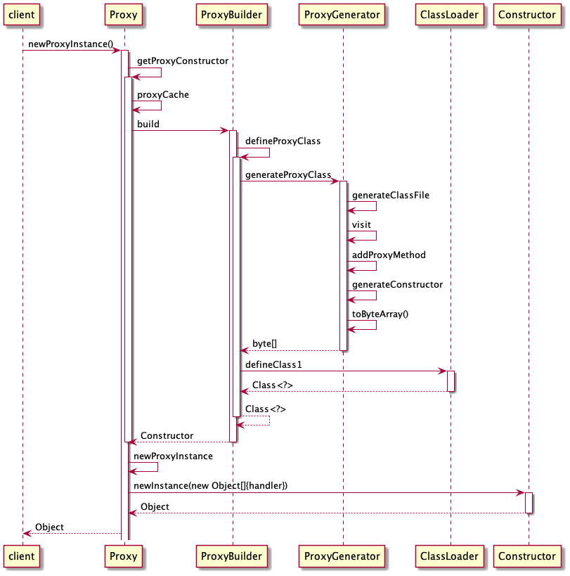
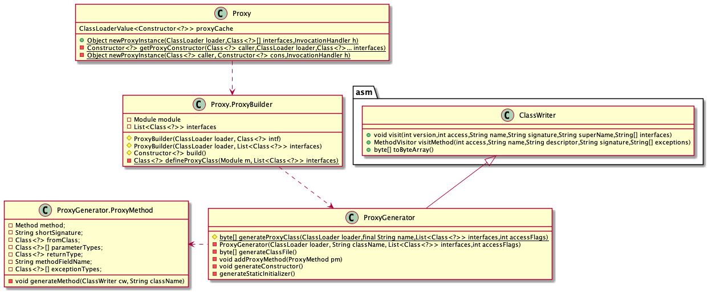
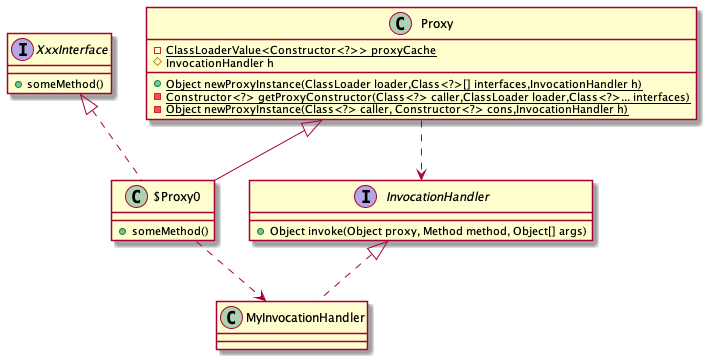

Java在JDK1.3后引入的动态代理机制，使我们可以在运行期动态的创建代理类。
>本文基于JDK14编写,JDK8后proxy类有较大变化,源代码和配置均不相同. 

使用动态代理实现AOP需要四个角色：
- 被代理的类、
- 被代理类的接口、
- 织入器（Proxy.newProxyInstance()）、
- InvocationHandler。

织入器使用接口反射机制生成一个代理类，然后在这个代理类中织入代码（切入逻辑）。InvocationHandler是切面，包含了Advice和Pointcut。


# Java proxy源代码分析

JDK proxy的入口是Proxy.newProxyInstance(),其接口声明如下:
```java
 public static Object newProxyInstance(ClassLoader loader,Class<?>[] interfaces,InvocationHandler h) 
```

java.lang.reflect.Proxy做了三个事情:
1. 判断是否有相应接口的缓存,如果有直接活动代理类的构造器缓存.
2. 如果是第一次创建该Class文件时，会创建ProxyBuilder并调用build()方法中.
3. 使用InvocationHandler作为构造参数创建代理类的实例.

由此可见,由于缓存,对单一接口Proxy并不会导致jvm堆空间的暴增.但在实现多个接口时,缓存无法命中,动态代理在运行期通过接口动态生成代理类。使用反射大量生成类文件可能引起Full GC造成性能影响，因为字节码文件加载后会 存放在JVM运行时区的方法区中（或持久代）。当方法区满的时候，会引起Full GC。因此当大量使用动态代理时，可以将持久代设置大一些，减少Full GC次数。

Proxy的序列图


ProxyBuilder负责对需要生成的class类的信息的组装:
1. 拼装代理类包名和类名，组织需要代理的方法
2. 调用ProxyGenerator生成.class 文件的字节码。
3. 调用ClassLoader native方法，传入字节码，生成Class对象。


核心类图

ProxyGenerator真正实现接口声明到字节码的转换,它继承了asm的ClassWriter抽象类.由于担心与其他工程同样使用ASM的应用版本冲突,JDK直接复制了ASM相关代码到新的包中.


## 查看生成的Class文件
ProxyGenerator.generateProxyClass()中有这样一个逻辑：
```java
if(saveGeneratedFiles) {
    //...
    //name生成代理类的全路径名
    //.class文件在系统运行的当前路径下的代理文件包名换成路径名.
    Path dir = Path.of(dotToSlash(name.substring(0, i)));
    Files.createDirectories(dir);
    path = dir.resolve(name.substring(i + 1) + ".class");
    //...
    Files.write(path, classFile);
    //...
 }
```

saveGeneratedFiles这个变量定义:

```java
private final static boolean saveGeneratedFiles =
    java.security.AccessController.doPrivileged( 
    new GetBooleanAction("jdk.proxy.ProxyGenerator.saveGeneratedFiles"))
    .booleanValue();
```
所以可以在main方法中做以下设置就可以看到生成的Proxy的Class文件了
```java
System.getProperties().setProperty("jdk.proxy.ProxyGenerator.saveGeneratedFiles", "true");
```
定义一个Action接口

```java
public interface Action {
    void doSomething();
}
```

创建一个Action的代理

```java
public static void main(String[] args) {
    System.getProperties().setProperty("jdk.proxy.ProxyGenerator.saveGeneratedFiles", "true");
    RealObject realObject = new RealObject();
    Action proxy = (Action) Proxy.newProxyInstance(ClassLoader.getSystemClassLoader(), new Class[]{Action.class}, new DynamicProxyHandler(realObject));
    proxy.doSomething();
}
```

反编译.class文件
```java
//com.sun,proxy.$Proxy0.class
package com.sun.proxy;
public final class $Proxy0 extends Proxy implements Action {
    public $Proxy0(InvocationHandler param1) {
        super(var1);
    }
    public final void doSomething() {
        try {
            super.h.invoke(this, m3, (Object[])null);
        } catch (RuntimeException | Error var2) {
            throw var2;
        } catch (Throwable var3) {
            throw new UndeclaredThrowableException(var3);
        }
    }
}

```
newInstance生成Proxy实例时，通过$Proxy0的Class对象，选择了这个InvocationHandler为参数的构造方法，传入我们定义的InvocationHandler并生成了一个 Proxy0的实例.InvocationHandler 里有realObject的逻辑以及我们的扩展逻辑，当我们调用Proxy0的doSomething方法时，就会调用到我们InvocationHandler 里 实现的invoke方法。

# 参考文献
1. [死磕Spring之AOP篇 - 初识JDK、CGLIB两种动态代理](https://www.cnblogs.com/lifullmoon/p/14654836.html)
# 附录
- 表达式expression:一个表达式回产生一个值
Expressions only contain identifiers, literals and operators, where operators include arithmetic and boolean operators, the function call operator () the subscription operator [] and similar, and can be reduced to some kind of "value".
- 语句Statement: 一个语句即执行一个动作,完成特定任务
Statements represent an action or command e.g print statements, assignment statements. Statements are everything that can make up a line (or several lines) of Python code. Note that expressions are statements as well. A statement does something. 

