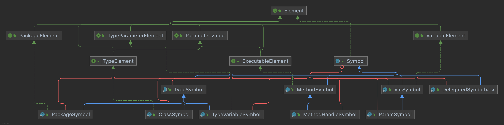
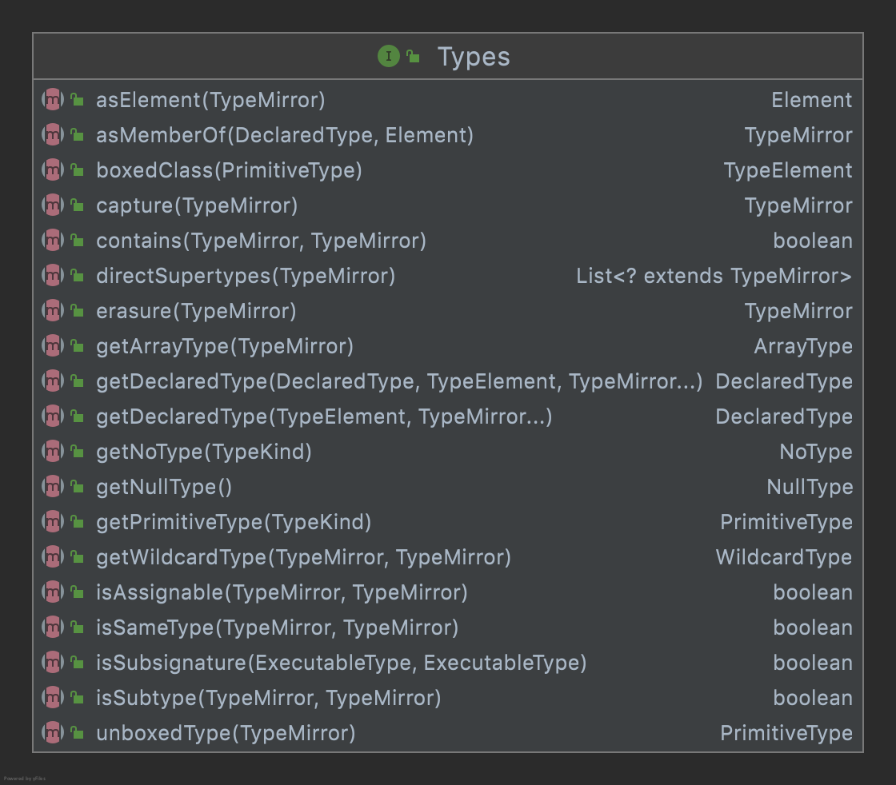

Java模型包结构

- javax.lang.model	
用来为 Java 编程语言建立模型的包的类和层次结构。
- javax.lang.model.element	
用于 Java 编程语言的模型元素的接口。
- javax.lang.model.type	
用来为 Java 编程语言类型建立模型的接口。
- javax.lang.model.util	
用来帮助处理程序元素和类型的实用工具。

软件包 javax.lang.model 的描述
用来为 Java 编程语言建立模型的包的类和层次结构。 此包及其子包的成员适用于语言建模、语言处理任务和 API（包括但并不仅限于注释处理框架）。

>此语言模型使用基于镜像的设计；请参阅Gilad Bracha 和 David Ungar 的Mirrors:Design Principles for Meta-level Facilities of Object-Oriented Programming Languages。发表于 2004 年 10 月召开的关于面向对象编程、系统、语言和应用程序的 ACM 程序会议（Proc. of the ACM Conf.）。
具体来说，该模型使静态语言构造（比如表示 java.util.Set 的元素）与某一元素所关联的类型系列（比如原始类型 java.util.Set、java.util.Set<String> 和 java.util.Set<T>）之间有所区别。


# 类型type


# 元素


术语“元素”用于表示程序元素，即构成程序的声明实体。 元素包括类，接口，方法，构造函数和字段。 **此包中的接口不对方法体内的程序结构进行建模;** 例如，没有for循环或try - finally块的表示。 但是，接口可以模拟仅出现在方法体内的一些结构，例如局部变量和匿名类。
当在注释处理的上下文中使用时，必须返回所表示的元素的准确模型。 由于这是一种语言模型，源代码提供了所讨论的构造的基准（参考）表示，而不是类似于类文件的可执行输出中的表示。 可执行输出可以作为创建建模元素的基础。 但是，将源代码转换为可执行输出的过程可能不允许恢复源代码表示的某些方面。 例如，无法从类文件中恢复source retention的注释，并且类文件可能无法提供源位置信息。

# 模型相关工具



# 工具使用案例
```java
// Utility elements that come with javax.annotation.processing
Elements elements = processingEnv.getElementUtils();
Types types = processingEnv.getTypeUtils();

// These are elements, they never have generic types associated
TypeElement listElement = elements.getTypeElement(List.class.getName());
TypeElement strElement  = elements.getTypeElement(String.class.getName());

// Build a Type: List<String>
DeclaredType listStrType = types.getDeclaredType(
                               listElement, 
                               strElement.asType());

// Build a Type: List<List<String>>
DeclaredType listlistStrType = types.getDeclaredType(
                               listElement,
                               listElement.asType(),
                               listStrType);
```

# 参考资料
1. [javax.lang.model.type源码解析](https://blog.csdn.net/qq_26000415/article/details/82260960)
2. [javax.lang.model.util源码解析](https://blog.csdn.net/qq_26000415/article/details/82383378)